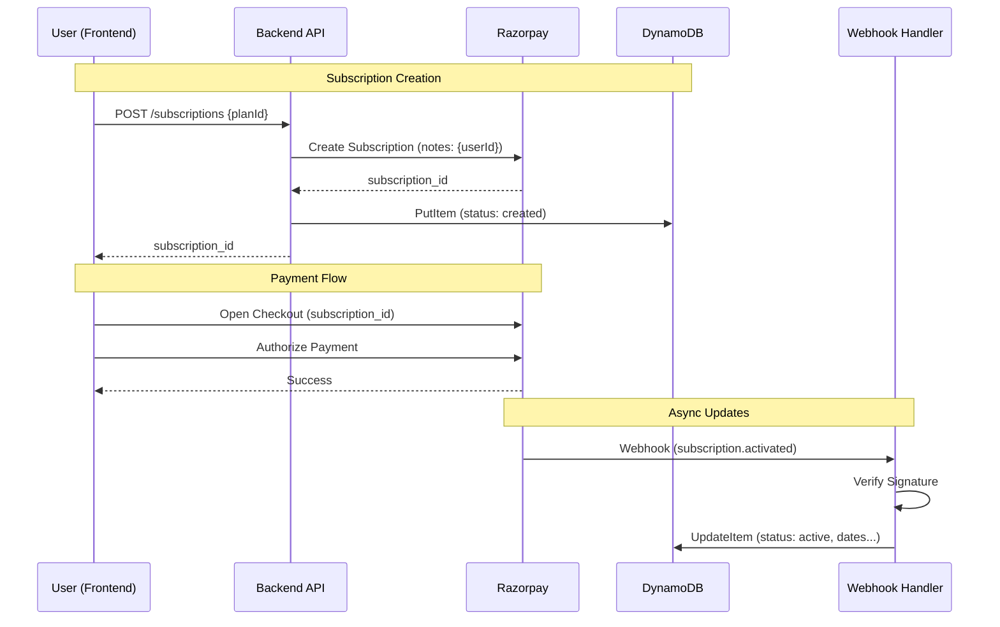

# Razorpay Integration Deep Dive

This document details the end-to-end integration of Razorpay in the Trading Journal application, covering frontend invocation, backend processing, data storage, and webhook handling.

## 1. Frontend Integration

The frontend handles user interaction, initiates payments/subscriptions, and handles the Razorpay Checkout modal.

### Key Files
- **Hook:** `Frontend/src/hooks/useRazorpay.ts`
- **API Client:** `Frontend/src/lib/api/razorpay.ts`
- **Component:** `Frontend/src/components/views/ProfileView.tsx` (Usage example)

### Subscription Flow (Primary)

1.  **Initiation:**
    - The user selects a plan.
    - `useRazorpay.initiateSubscription` is called with `planId`.
    - **API Call:** `POST /subscriptions` is sent to the backend.
      - **Payload:** `{ planId: string, customerNotify: 1 }`
    - **Response:** Backend returns `{ subscriptionId: string, ... }`.

2.  **Razorpay Checkout:**
    - The frontend initializes `window.Razorpay` with:
      - `key`: `VITE_RAZORPAY_KEY_ID`
      - `subscription_id`: The ID received from the backend.
      - `name`, `description`: Displayed in the modal.
      - `handler`: A callback function for success.
    - `razorpayInstance.open()` is called to show the payment modal.

3.  **Completion:**
    - **Success:** The `handler` is triggered.
      - It logs the response.
      - It waits (e.g., 2 seconds) to allow the webhook to process.
      - It calls `onSuccess` callback (updates UI).
    - **Failure:** `razorpayInstance.on('payment.failed')` triggers `onFailure`.

### One-Time Payment Flow (Legacy)

1.  **Initiation:**
    - `useRazorpay.initiatePayment` is called.
    - **API Call:** `POST /payments/create-order` is sent to the backend.
      - **Payload:** `{ amount: number, currency: string }`
    - **Response:** Backend returns `{ orderId: string, amount: number, currency: string }`.

2.  **Razorpay Checkout:**
    - `window.Razorpay` is initialized with `order_id`.

3.  **Verification:**
    - On success, the `handler` receives `razorpay_order_id`, `razorpay_payment_id`, and `razorpay_signature`.
    - **API Call:** `POST /payments/verify` is sent to the backend to verify the signature.

---

## 2. Backend Processing

The backend exposes API endpoints via API Gateway and Lambda functions to handle requests.

### API Endpoints

| Method | Path | Handler | Description |
| :--- | :--- | :--- | :--- |
| `POST` | `/subscriptions` | `create-razorpay-subscription` | Creates a subscription in Razorpay and DB. |
| `POST` | `/payments/create-order` | `create-order-razorpay` | Creates a standard order (one-time). |
| `POST` | `/payments/verify` | `verify-payment-razorpay` | Verifies payment signature (one-time). |
| `POST` | `/payments/webhook` | `razorpay-webhook` | Handles async events from Razorpay. |

### Subscription Creation Logic (`create-razorpay-subscription`)

1.  **Validation:** Checks for `planId`.
2.  **Razorpay API:** Calls `razorpay.subscriptions.create` with:
    - `plan_id`: From request.
    - `total_count`: Defaults to 120 (10 years) if not provided.
    - `quantity`: Defaults to 1.
    - `notes`: Includes `userId` (Critical for mapping webhooks back to users).
3.  **Database Storage:** Creates an initial record in DynamoDB (`SUBSCRIPTIONS_TABLE`).
    - **Status:** `created`

---

## 3. Data Storage (DynamoDB)

**Table Name:** `TradingJournal-Subscriptions-{Env}` (e.g., `dev`, `prod`)
**Partition Key:** `userId` (String)

### Schema & Attributes

| Attribute | Type | Description |
| :--- | :--- | :--- |
| `userId` | String | **PK**. The Cognito User ID. |
| `subscriptionId` | String | Razorpay Subscription ID (`sub_...`). |
| `planId` | String | Razorpay Plan ID (`plan_...`). |
| `status` | String | Current status (`active`, `created`, `halted`, etc.). |
| `quantity` | Number | Number of subscriptions (usually 1). |
| `totalCount` | Number | Total billing cycles. |
| `paidCount` | Number | Number of successful charges. |
| `remainingCount` | Number | Cycles remaining. |
| `startAt` | String | ISO Date. Subscription start time. |
| `endAt` | String | ISO Date. Subscription end time (if cancelled/completed). |
| `chargeAt` | String | ISO Date. Next billing date. |
| `currentStart` | String | ISO Date. Start of current billing cycle. |
| `currentEnd` | String | ISO Date. End of current billing cycle. |
| `authAttempts` | Number | Number of auth attempts. |
| `createdAt` | String | ISO Date. Record creation. |
| `updatedAt` | String | ISO Date. Last update. |

---

## 4. Webhook Handling

The webhook is the source of truth for subscription status updates.

**Handler:** `Backend/src/handlers/razorpay-webhook/app.ts`
**Secret:** Stored in SSM Parameter Store (`/trading-journal/{env}/razorpay/webhook-secret`).

### Verification
- Validates `x-razorpay-signature` header using HMAC-SHA256 with the webhook secret.

### Event Processing

The handler listens for specific events and updates the DynamoDB record for the `userId` found in `subscription.notes`.

| Event | Action | DB Updates |
| :--- | :--- | :--- |
| `subscription.activated` | First successful payment. | `status`='active', `paidCount`, `currentStart`, `currentEnd`, `chargeAt` |
| `subscription.charged` | Recurring payment success. | `status`='active', `paidCount`, `remainingCount`, `currentStart`, `currentEnd`, `chargeAt` |
| `subscription.pending` | Payment failed, retrying. | `status`='pending' |
| `subscription.halted` | All retries failed. | `status`='halted' |
| `subscription.cancelled` | Cancelled by user/admin. | `status`='cancelled', `endedAt` |
| `subscription.completed` | All cycles finished. | `status`='completed', `endedAt` |
| `subscription.paused` | Paused. | `status`='paused' |
| `subscription.resumed` | Resumed. | `status`='active' |
| `subscription.updated` | Plan changed. | `planId`, `quantity`, `totalCount`, `remainingCount` |
| `payment.captured` | One-time payment success. | `status`='active', `paymentId`, `orderId`, `amount` |

### Data Flow Diagram

